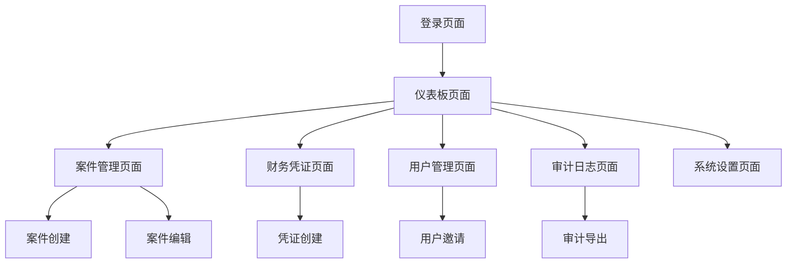

## 1. 产品概述

将 lawcaspro 升级为企业级 Legal ERP 安全架构，采用 Zero Trust 安全模型和 Multi-Tenant 隔离机制。专为律师事务所和法律服务机构设计，提供完整的案件管理、财务控制、审计追踪和数据安全防护。

目标市场：中大型律师事务所、企业法务部门、法律服务机构，满足其对数据安全、合规审计和多租户管理的企业级需求。

## 2. 核心功能

### 2.1 用户角色

| 角色      | 注册方式    | 核心权限                  |
| ------- | ------- | --------------------- |
| Staff   | 管理员邀请注册 | 仅查看和编辑自己创建的案件         |
| Lawyer  | 管理员邀请注册 | 查看和编辑自己创建的案件 + 被分配的案件 |
| Partner | 管理员邀请注册 | 查看和编辑整个律所的所有案件        |
| Founder | 系统初始化创建 | 全平台管理权限，可查看所有律所数据     |

### 2.2 功能模块

企业级 Legal ERP 安全架构包含以下核心页面：

1. **登录页面**：JWT 认证、多因素认证、设备识别
2. **仪表板页面**：安全概览、审计日志、系统状态监控
3. **案件管理页面**：案件创建、编辑、分配、状态跟踪
4. **财务凭证页面**：付款凭证管理、财务审批流程
5. **用户管理页面**：用户邀请、角色分配、权限管理
6. **审计日志页面**：操作记录、数据变更追踪、导出审计报告
7. **系统设置页面**：安全策略配置、加密设置、备份管理

### 2.3 页面详情

| 页面名称   | 模块名称  | 功能描述                |
| ------ | ----- | ------------------- |
| 登录页面   | 身份认证  | 验证用户身份，支持JWT令牌和设备绑定 |
| 登录页面   | 多因素认证 | 短信/邮件二次验证，增强安全性     |
| 仪表板页面  | 安全概览  | 显示系统安全状态、异常登录警报     |
| 仪表板页面  | 审计统计  | 展示操作统计、数据变更趋势图表     |
| 案件管理页面 | 案件列表  | 显示用户权限范围内的案件列表      |
| 案件管理页面 | 案件创建  | 创建新案件，自动记录创建者和律所ID  |
| 案件管理页面 | 案件编辑  | 编辑案件信息，记录修改历史       |
| 财务凭证页面 | 凭证列表  | 显示付款凭证，支持筛选和搜索      |
| 财务凭证页面 | 凭证创建  | 创建付款凭证，敏感信息自动加密     |
| 用户管理页面 | 用户列表  | 管理律所内所有用户账户         |
| 用户管理页面 | 角色分配  | 分配用户角色，控制访问权限       |
| 审计日志页面 | 操作记录  | 查看所有用户操作记录          |
| 审计日志页面 | 审计导出  | 导出审计报告，支持时间段筛选      |
| 系统设置页面 | 安全策略  | 配置密码策略、会话超时等安全设置    |
| 系统设置页面 | 数据加密  | 管理敏感数据加密密钥和算法       |

## 3. 核心流程

### 用户登录流程

用户访问登录页面 → 输入用户名密码 → 系统验证凭据 → 生成JWT令牌 → 记录登录会话 → 跳转仪表板

### 案件创建流程

用户点击创建案件 → 后端验证JWT令牌 → 提取用户信息和律所ID → 创建案件记录 → 记录审计日志 → 返回创建结果

### 数据访问流程

用户请求数据 → 中间件验证JWT → 检查用户角色和权限 → 应用RLS策略 → 返回权限范围内数据

## 4. 用户界面设计

### 4.1 设计风格

* **主色调**：深蓝色 (#1E3A8A) 体现专业性

* **辅助色**：浅灰色 (#F3F4F6) 用于背景

* **警示色**：红色 (#DC2626) 用于安全警报

* **按钮样式**：圆角矩形，悬停效果

* **字体**：系统默认字体，标题16px，正文14px

* **布局风格**：左侧导航栏 + 右侧内容区域的卡片式布局

* **图标风格**：使用专业线性图标，保持简洁统一

### 4.2 页面设计概览

| 页面名称   | 模块名称 | UI元素                 |
| ------ | ---- | -------------------- |
| 登录页面   | 身份认证 | 居中卡片布局，蓝色渐变背景，白色登录表单 |
| 仪表板页面  | 安全概览 | 网格布局显示安全指标卡片，包含图表和数字 |
| 案件管理页面 | 案件列表 | 表格布局，支持排序筛选，操作按钮悬浮显示 |
| 财务凭证页面 | 凭证列表 | 卡片式列表，敏感信息显示为加密图标    |
| 用户管理页面 | 用户列表 | 头像+用户名+角色标签，支持批量操作   |
| 审计日志页面 | 操作记录 | 时间轴布局，显示操作类型和用户头像    |
| 系统设置页面 | 安全策略 | 表单配置，开关组件，实时保存提示     |

### 4.3 响应式设计

采用桌面端优先设计，支持平板和手机自适应。触摸设备优化：增大点击区域，支持手势操作，重要功能按钮放置在易于触摸的位置。

### 4.4 安全提示设计

* 登录异常时显示红色警告横幅

* 敏感操作需要二次确认弹窗

* 数据导出显示水印警告

* 会话超时前

