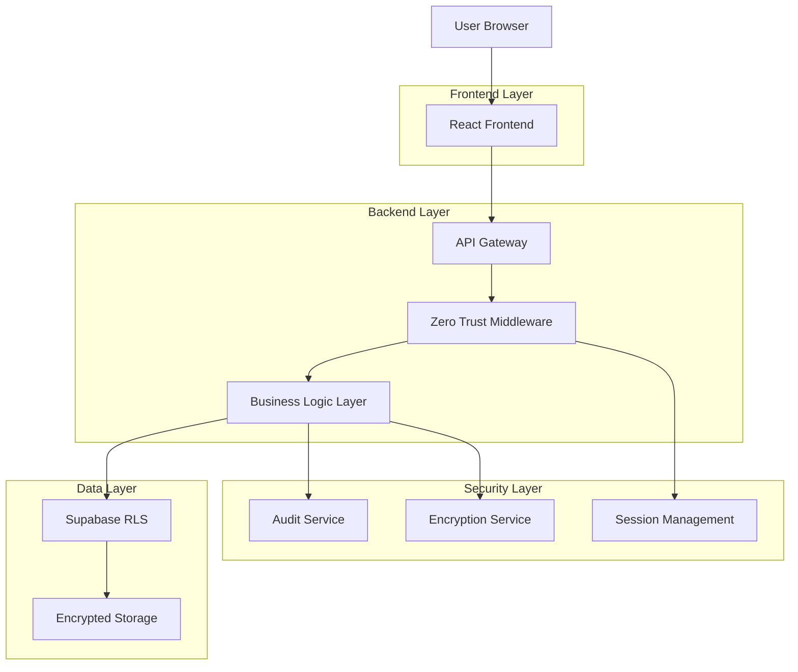
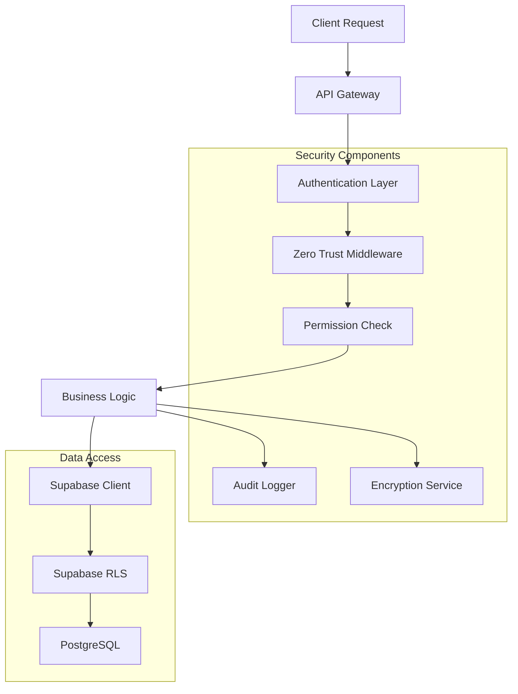
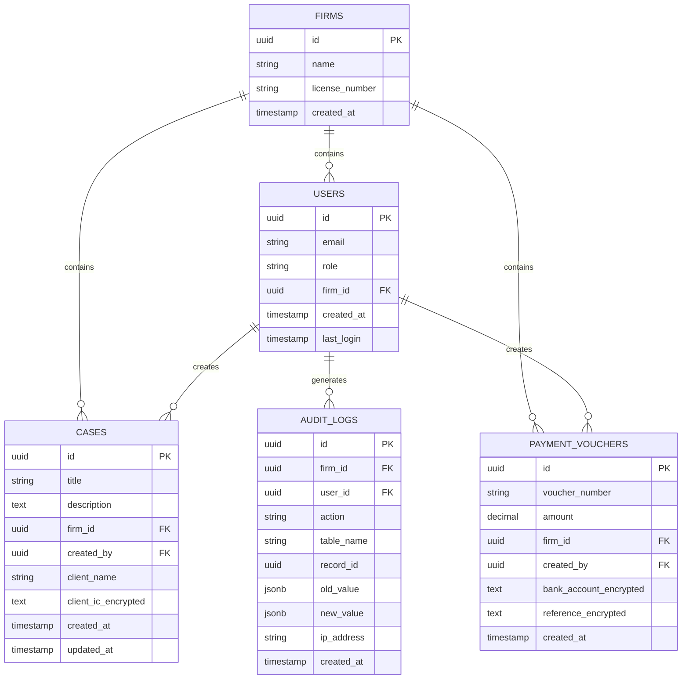

## 1. 架构设计



## 2. 技术描述

- **前端**: React@18 + TypeScript + Vite + TailwindCSS
- **初始化工具**: vite-init
- **后端**: Node.js@18 + Express + Supabase SDK
- **数据库**: Supabase (PostgreSQL)
- **身份验证**: Supabase Auth + JWT
- **加密**: Node.js crypto 模块 (AES-256-CBC)
- **审计**: 自定义审计服务 + Supabase

## 3. 路由定义

| 路由 | 用途 |
|------|------|
| /login | 用户登录页面 |
| /dashboard | 主仪表板，显示安全概览 |
| /cases | 案件管理页面 |
| /cases/new | 创建新案件 |
| /cases/:id | 案件详情和编辑 |
| /payments | 财务凭证管理 |
| /users | 用户管理页面 |
| /audit | 审计日志查看 |
| /settings | 系统安全设置 |
| /api/auth/* | 身份验证API端点 |
| /api/cases/* | 案件管理API |
| /api/payments/* | 财务凭证API |
| /api/audit/* | 审计相关API |

## 4. API 定义

### 4.1 核心API

**用户认证**
```
POST /api/auth/login
```

请求:
| 参数名 | 参数类型 | 必需 | 描述 |
|--------|----------|------|------|
| email | string | true | 用户邮箱 |
| password | string | true | 用户密码 |

响应:
| 参数名 | 参数类型 | 描述 |
|--------|----------|------|
| token | string | JWT访问令牌 |
| user | object | 用户信息 |
| firm_id | string | 律所ID |

**创建案件**
```
POST /api/cases/create
```

请求:
| 参数名 | 参数类型 | 必需 | 描述 |
|--------|----------|------|------|
| title | string | true | 案件标题 |
| description | string | false | 案件描述 |
| client_name | string | true | 客户姓名 |
| client_ic | string | false | 客户身份证（加密存储）|

响应:
| 参数名 | 参数类型 | 描述 |
|--------|----------|------|
| id | string | 案件ID |
| title | string | 案件标题 |
| created_at | timestamp | 创建时间 |

**获取案件列表**
```
GET /api/cases/list
```

请求头:
```
Authorization: Bearer {jwt_token}
```

响应:
| 参数名 | 参数类型 | 描述 |
|--------|----------|------|
| cases | array | 案件列表 |
| total | number | 总记录数 |

### 4.2 零信任安全验证

```javascript
// 中间件验证函数
export async function verifyZeroTrust(req) {
  // 1. 验证JWT令牌
  const user = await verifyUser(req);
  
  // 2. 从JWT提取用户信息（不信任前端传参）
  const firmId = user.user_metadata.firm_id;
  const userId = user.id;
  const userRole = user.user_metadata.role;
  
  // 3. 验证用户权限
  const hasPermission = await checkUserPermission(userId, firmId, userRole);
  
  return {
    userId,
    firmId,
    userRole,
    hasPermission
  };
}
```

## 5. 服务器架构图



## 6. 数据模型

### 6.1 数据模型定义



### 6.2 数据定义语言

**用户表 (users)**
```sql
-- 创建用户表
CREATE TABLE users (
    id UUID PRIMARY KEY DEFAULT gen_random_uuid(),
    email VARCHAR(255) UNIQUE NOT NULL,
    password_hash VARCHAR(255) NOT NULL,
    name VARCHAR(100) NOT NULL,
    role VARCHAR(20) NOT NULL CHECK (role IN ('staff', 'lawyer', 'partner', 'founder')),
    firm_id UUID NOT NULL,
    is_active BOOLEAN DEFAULT true,
    last_login TIMESTAMP WITH TIME ZONE,
    created_at TIMESTAMP WITH TIME ZONE DEFAULT NOW(),
    updated_at TIMESTAMP WITH TIME ZONE DEFAULT NOW()
);

-- 创建索引
CREATE INDEX idx_users_firm_id ON users(firm_id);
CREATE INDEX idx_users_email ON users(email);
CREATE INDEX idx_users_role ON users(role);
```

**案件表 (cases)**
```sql
-- 创建案件表
CREATE TABLE cases (
    id UUID PRIMARY KEY DEFAULT gen_random_uuid(),
    title VARCHAR(255) NOT NULL,
    description TEXT,
    firm_id UUID NOT NULL,
    created_by UUID NOT NULL,
    client_name VARCHAR(255) NOT NULL,
    client_ic_encrypted TEXT,
    status VARCHAR(20) DEFAULT 'active' CHECK (status IN ('active', 'closed', 'archived')),
    created_at TIMESTAMP WITH TIME ZONE DEFAULT NOW(),
    updated_at TIMESTAMP WITH TIME ZONE DEFAULT NOW()
);

-- 创建索引
CREATE INDEX idx_cases_firm_id ON cases(firm_id);
CREATE INDEX idx_cases_created_by ON cases(created_by);
CREATE INDEX idx_cases_status ON cases(status);

-- 启用RLS
ALTER TABLE cases ENABLE ROW LEVEL SECURITY;

-- 创建RLS策略
CREATE POLICY cases_firm_isolation ON cases
    FOR ALL
    USING (firm_id = auth.jwt() ->> 'firm_id');

CREATE POLICY staff_case_visibility ON cases
    FOR SELECT
    USING (
        firm_id = auth.jwt() ->> 'firm_id' 
        AND (
            auth.jwt() ->> 'role' IN ('partner', 'founder') 
            OR created_by = auth.uid()
        )
    );
```

**审计日志表 (audit_logs)**
```sql
-- 创建审计日志表
CREATE TABLE audit_logs (
    id UUID PRIMARY KEY DEFAULT gen_random_uuid(),
    firm_id UUID NOT NULL,
    user_id UUID NOT NULL,
    action VARCHAR(50) NOT NULL,
    table_name VARCHAR(100) NOT NULL,
    record_id UUID,
    old_value JSONB,
    new_value JSONB,
    ip_address INET,
    user_agent TEXT,
    created_at TIMESTAMP WITH TIME ZONE DEFAULT NOW()
);

-- 创建索引
CREATE INDEX idx_audit_firm_id ON audit_logs(firm_id);
CREATE INDEX idx_audit_user_id ON audit_logs(user_id);
CREATE INDEX idx_audit_table_name ON audit_logs(table_name);
CREATE INDEX idx_audit_created_at ON audit_logs(created_at DESC);
```

**用户会话表 (user_sessions)**
```sql
-- 创建用户会话表
CREATE TABLE user_sessions (
    id UUID PRIMARY KEY DEFAULT gen_random_uuid(),
    user_id UUID NOT NULL,
    firm_id UUID NOT NULL,
    ip_address INET,
    device_info JSONB,
    login_time TIMESTAMP WITH TIME ZONE DEFAULT NOW(),
    last_activity TIMESTAMP WITH TIME ZONE DEFAULT NOW(),
    is_active BOOLEAN DEFAULT true
);

-- 创建索引
CREATE INDEX idx_session_user_id ON user_sessions(user_id);
CREATE INDEX idx_session_firm_id ON user_sessions(firm_id);
CREATE INDEX idx_session_active ON user_sessions(is_active);
```

### 6.3 敏感数据加密实现

```javascript
// 加密模块
import crypto from 'crypto';

const ALGORITHM = 'aes-256-cbc';
const KEY = Buffer.from(process.env.DATA_ENCRYPTION_KEY, 'hex');

export function encrypt(text) {
    const iv = crypto.randomBytes(16);
    const cipher = crypto.createCipheriv(ALGORITHM, KEY, iv);
    let encrypted = cipher.update(text, 'utf8', 'hex');
    encrypted += cipher.final('hex');
    return iv.toString('hex') + ':' + encrypted;
}

export function decrypt(encryptedText) {
    const [ivHex, encrypted] = encryptedText.split(':');
    const iv = Buffer.from(ivHex, 'hex');
    const decipher = crypto.createDecipheriv(ALGORITHM, KEY, iv);
    let decrypted = decipher.update(encrypted, 'hex', 'utf8');
    decrypted += decipher.final('utf8');
    return decrypted;
}
```

### 6.4 权限矩阵

| 角色 | 创建案件 | 查看所有案件 | 编辑所有案件 | 删除案件 | 查看审计日志 | 管理用户 |
|------|----------|--------------|--------------|----------|--------------|----------|
| Staff | ✓ | 仅自己的 | 仅自己的 | ✗ | ✗ | ✗ |
| Lawyer | ✓ | 自己+分配的 | 自己+分配的 | ✗ | ✗ | ✗ |
| Partner | ✓ | ✓ | ✓ | ✓ | ✓ | ✓ |
| Founder | ✓ | ✓ | ✓ | ✓ | ✓ | ✓ |